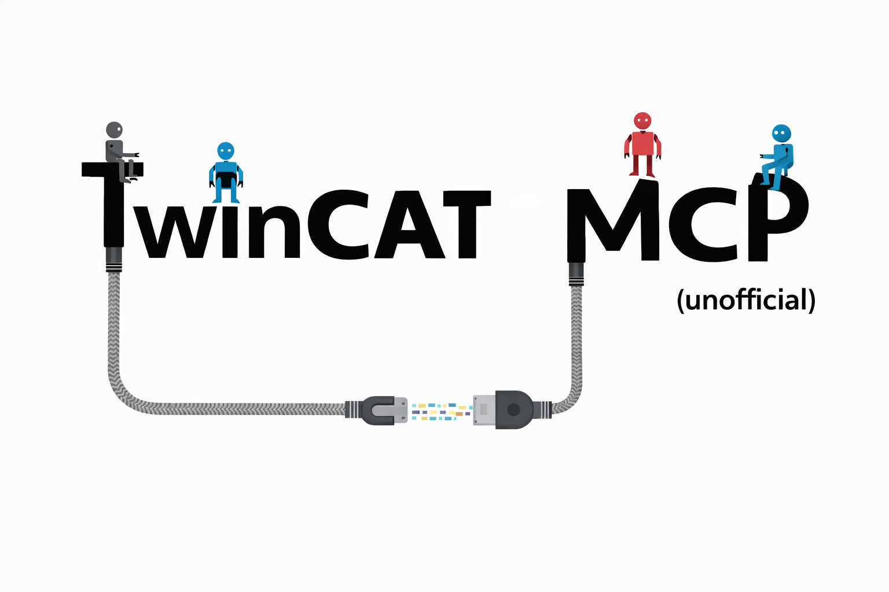

<p align="center">
  
</p>

<h1 align="center">TwinCAT MCP Server</h1>

<p align="center">Build, deploy, and poke at TwinCAT PLCs from any MCP-aware AI client.</p>

---

## What it does

An MCP server that wraps the TwinCAT Automation Interface and ADS so an AI assistant (VS Code + Copilot, Cursor, Claude Desktop, etc.) can do your PLC work for you: build a solution, read compile errors, flip I/O, deploy to a target, run TcUnit, read and write symbols, and so on.

Unofficial. Not affiliated with Beckhoff.

## Prerequisites

| Software | Version |
|---|---|
| Windows | 10 or 11 |
| Visual Studio | 2019 or 2022 with the ".NET desktop development" workload |
| .NET Framework | 4.7.2 Developer Pack |
| TwinCAT XAE | 3.1.4024 or newer |
| Python | 3.10 or newer, on PATH |
| MCP client | VS Code + Copilot, Cursor, Claude Desktop, etc. |

## Install

```powershell
git clone https://github.com/eponce92/twincat-mcp.git
cd twincat-mcp
.\setup.bat
```

`setup.bat` checks prerequisites, builds `TcAutomation.exe`, installs the Python deps, and registers the server with VS Code.

### Manual registration

If the script fails or you want a different client:

```powershell
.\scripts\build.ps1
pip install -r mcp-server/requirements.txt
```

Then point your MCP client at `mcp-server/server.py`.

**VS Code (global):**
```powershell
code --add-mcp '{"name":"twincat-automation","type":"stdio","command":"python","args":["C:/path/to/twincat-mcp/mcp-server/server.py"]}'
```

**Cursor (global)** add to `~/.cursor/mcp.json`:
```json
{
  "mcpServers": {
    "twincat-automation": {
      "command": "python",
      "args": ["C:/path/to/twincat-mcp/mcp-server/server.py"]
    }
  }
}
```

Restart the client and enable the server.

## Safety

The server starts in SAFE mode. Anything that can touch a running machine is blocked until you arm it:

```
Arm dangerous operations to deploy the hotfix.
```

Armed mode auto-expires after 5 minutes (override with `TWINCAT_ARMED_TTL` seconds). You can also disarm manually by calling `twincat_arm_dangerous_operations` with `disarm: true`.

Tools that require armed mode:
`twincat_activate`, `twincat_restart`, `twincat_deploy`, `twincat_set_state`, `twincat_write_var`, and `twincat_run_tcunit` against a remote target.

The three most destructive tools (`twincat_activate`, `twincat_restart`, `twincat_deploy`) also require `confirm: "CONFIRM"` as an explicit second step.

## Tools

| Tool | What it does |
|---|---|
| `twincat_arm_dangerous_operations` | Toggle SAFE/ARMED mode. |
| `twincat_build` | Build a solution, return errors and warnings with file paths and line numbers. |
| `twincat_check_all_objects` | Compile every object including unreferenced ones. Catches bugs a normal build skips. |
| `twincat_static_analysis` | Static analysis via TE1200 (license required). |
| `twincat_clean` | Remove build artifacts. |
| `twincat_get_info` | TwinCAT version, VS version, PLCs in the solution. |
| `twincat_generate_library` | Export a PLC project as a `.library` file. Existing output is renamed to `*.backup_yyyyMMdd_HHmmss.library`. |
| `twincat_set_target` | Set the target AMS Net ID. |
| `twincat_activate` | Activate configuration on the target. Armed + confirm. |
| `twincat_restart` | Restart TwinCAT runtime. Armed + confirm. |
| `twincat_deploy` | Build, activate, restart. Armed + confirm. |
| `twincat_list_routes` | List ADS routes from the local router. |
| `twincat_get_state` | Runtime state (Run/Config/Stop) via ADS. |
| `twincat_set_state` | Change runtime state via ADS. Armed. |
| `twincat_read_var` | Read a PLC variable by symbol path. |
| `twincat_write_var` | Write a PLC variable. Armed. |
| `twincat_list_plcs` | PLC projects and their AMS ports. |
| `twincat_set_boot_project` | Configure boot project autostart. |
| `twincat_disable_io` | Enable or disable I/O devices (test without hardware). |
| `twincat_set_variant` | Get or set the project variant (4024+). |
| `twincat_list_tasks` | Real-time tasks with cycle times and priorities. |
| `twincat_configure_task` | Enable/disable a task, set autostart. |
| `twincat_configure_rt` | Set RT CPU cores and load limit. |
| `twincat_get_error_list` | Contents of the VS Error List (errors, warnings, ADS messages). |
| `twincat_run_tcunit` | Full TcUnit workflow: build, configure test task, set boot, optional I/O disable, activate, restart, poll, report. Armed when remote. |
| `twincat_kill_stale` | Kill orphaned VS/XAE processes left from crashed runs. |

### `twincat_run_tcunit` parameters

- `solutionPath` (required)
- `amsNetId` (default `127.0.0.1.1.1`)
- `taskName` (auto-detected if only one)
- `plcName`
- `timeoutMinutes` (default 10)
- `disableIo` (default false)
- `skipBuild` (default false)

Local targets (`127.0.0.1.1.1`) do not require armed mode. Remote targets do.

## Example prompts

```
Build my TwinCAT project at C:\Projects\MyMachine\Solution.sln
Check all objects in TcForgeExample
Read MAIN.bRunning from the PLC
What is the TwinCAT state on 172.18.236.100.1.1?
Disable I/O and activate to the test PLC
Generate a library for PLC 'MainPlc' into C:\Artifacts\Libraries
Run TcUnit tests on my project
```

## Troubleshooting

**Server does not start.** In VS Code: `Ctrl+Shift+P` > `MCP: List Servers` > Start and Trust. In Cursor: Settings > MCP & Integrations > enable the server.

**`MSB4803: ResolveComReference not supported`.** You built with `dotnet build` instead of MSBuild. Run `.\setup.bat` or `.\scripts\build.ps1`.

**TwinCAT or Visual Studio not found.** Force the version in the prompt: `Build my project with TwinCAT version 3.1.4026.17`.

**ADS connection failed.** Check the AMS Net ID, confirm the route exists in the TwinCAT router, and that port 48898 is open through the firewall.

## License

MIT. See `LICENSE`.
